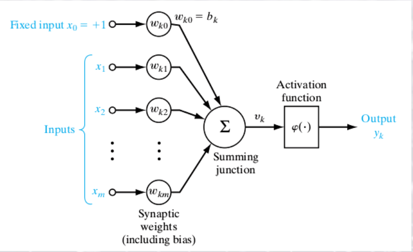

### Preceptrons
---
#### Biological Inspiration
- Essentially modeled after a single neuron
- What happens when an electron goes through the brain?
- Hebb's Postulate: If two neurons fire "close in time" then strength of synaptic connection between them increases.
  - Neurons that are fired together are wired together
- $$\Delta W_{ij}(t)=\eta v_iv_jg(t_{v_i},t_{v_j}) $$
- Perceptrons as simplified neurons
  - Input is $x_n$
  - weights are $w_n$
  - $w_0$ is called the **bias**
  - $-w_0$ is called the **threshold**
  - Output $y$ is +1 if the sum of the inputs tiumes the weights is greater or equal to the threshhold.
  - $$ y=a(w*x) $$

---
#### McCulloch & Pitts Neuron Model (1943)
- 
- $w_i$ weighted inputs
- **adder** that sums the input signals
- **activation function** that decides whether the neuron fires for the cretain inputs.
- Limitations & Deviations:
  - linear, doesn't account for spike trains, fixed threshold, sequential updating is implicit, weights can be + or -, real neurons have synapses that link back to themselves, other biological aspects ignored
---
#### Decision Surfaces
- Assume data can be seperated into two classes, (+) and (-), by a linear **decision surface**
- Assuming data is $n$-dimensional, a perception represents a $(n-1)$-dimensional **hyperplane** that seperates the data into two classes, positive and negative

---
#### Perceptron Learning
- How do we determine the weights?
  - Through training (cue Rocky montage)
- Input instance: $x^k = (x_1,x_2,...x_n)$
- With target class $t^k \in {0,1}$
- Goals
  - Correctly classify the training data
  - generalize to unseen data
- Find **w** that minimizes average loss
  - $$ J(w) = \frac 1 M \sum^M_{k=1}L(w,x^k,t^k) $$
  - M is the number of training examples and L is a loss function
- Convex: For any pair of points within a region, exery point on a line between the points is in that region
  - The entire line fits in a region or shape

---
#### Gradient Descent
- Gradient is the direction of fastest increase
- The gradient descent is moving the opposite direction.
- Steps
  - Initialize Randomly: $\theta_0 = random$
  - Update w/ small steps: $\theta_{t+1}=\theta_t-\eta \nabla_{\theta}R|_{\theta_t}$
  - I have no idea what that formula means but it was really hard to type in md
  - $\eta$ is a hyperparameter. That means it's set outside of the learning algorithim itself.
  - Most likely to converge to the min
- True Gradient Descent
  - One epoch: one iteration through the training data
  - After each epoch, compute average loss over the training set
- Problem w/ True gradient descent
  - Training process is slow
  - Training process can land in local optimum
- Stochastic Gradient Descent:
  - Instead of doing weight update after all training example have been processed, do weight update after each training example has been processed
  - Stochastic gradient descent approximates true gradient descent increasingly well as $\eta \to {1 \over \infty}$
---
#### Train a perceptron
- We defined $J = \frac 1 2 (y-t)^2$
- Use: $J = \frac 1 2 ((w*x)-t)^2$
- Then: $\frac {\delta J} {\delta w_i} = ((w*x)-t)x^k_i$ **Delta Rule**
- Finally: $\Delta w_i = \eta \frac {\delta J} {\delta w_i} = \eta (y^k - t^k)x^k_i$
- **Perceptron Learning Algorithim**
  - For k = 1 to M (total number in training set):
  1. Select next training example $(x^k, t^k)$.
  2. Run the perceptron with input $x^k$ and weights w to obtain y.
  3. if $y \not ={t^k}$, update weights
  4. $w_i \larr w_i - \Delta w_i$ , $\Delta w_i = \eta \frac {\delta J} {\delta w_i} = \eta (y^k - t^k)x^k_i$
- 
